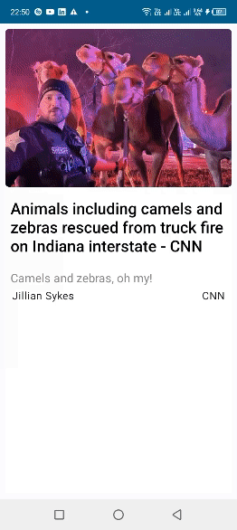

# Habari News App

The App uses a set of Android Jetpack libraries plus Retrofit to dispay news data from a REST API (https://newsapi.org/).

### Prerequisites

The project has all required dependencies in the gradle files. Add the Project to Android Studio or
Intelij and build.All the required dependencies will be downloaded and installed.

## Architecture

The project uses MVVM architecture pattern with a multi-modular structure.

## Libraries
* [JetPack Compose](https://developer.android.com/jetpack/compose) -  Accelerates UI development
  on Android. Quickly bring your app to life with less code, powerful tools, and intuitive Kotlin APIs.
* [ViewModel](https://developer.android.com/topic/libraries/architecture/viewmodel/) - Manage UI
  related data in a lifecycle conscious way and act as a channel between use cases and ui
* [Navigation Component](https://developer.android.com/guide/navigation/navigation-getting-started)
  - Android Jetpack's Navigation component helps in implementing navigation between fragments
* [Hilt Android](https://developer.android.com/training/dependency-injection/hilt-android) - For Dependency Injection.
* [Retrofit](https://square.github.io/retrofit/) - To access the Rest Api
* [Kotlin Flow](https://developer.android.com/kotlin/flow) - To access data sequentially
* [Coroutines](https://developer.android.com/kotlin/coroutines) - concurrency design pattern that you
  can use on Android to simplify code that executes asynchronously.
* [Coil](https://coil-kt.github.io/coil/) - An image loading library for Android

## Screenshots
||||
|:----:|:----:|:----:|

## Demo

